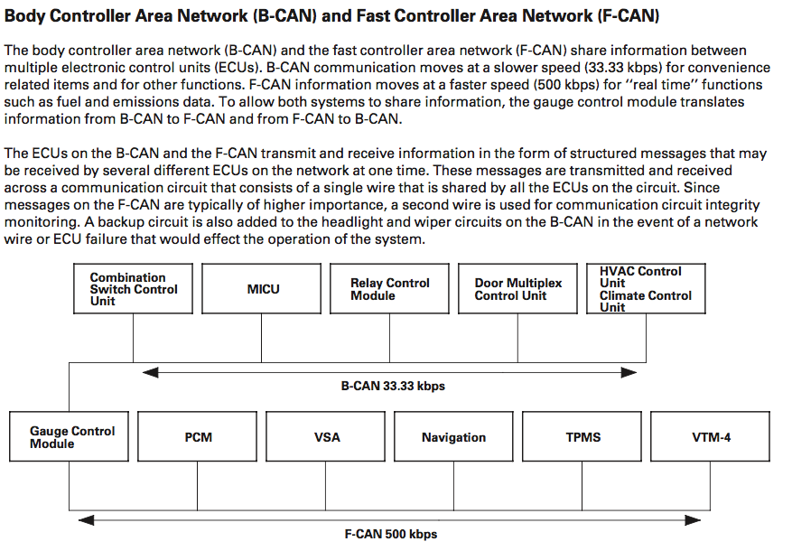
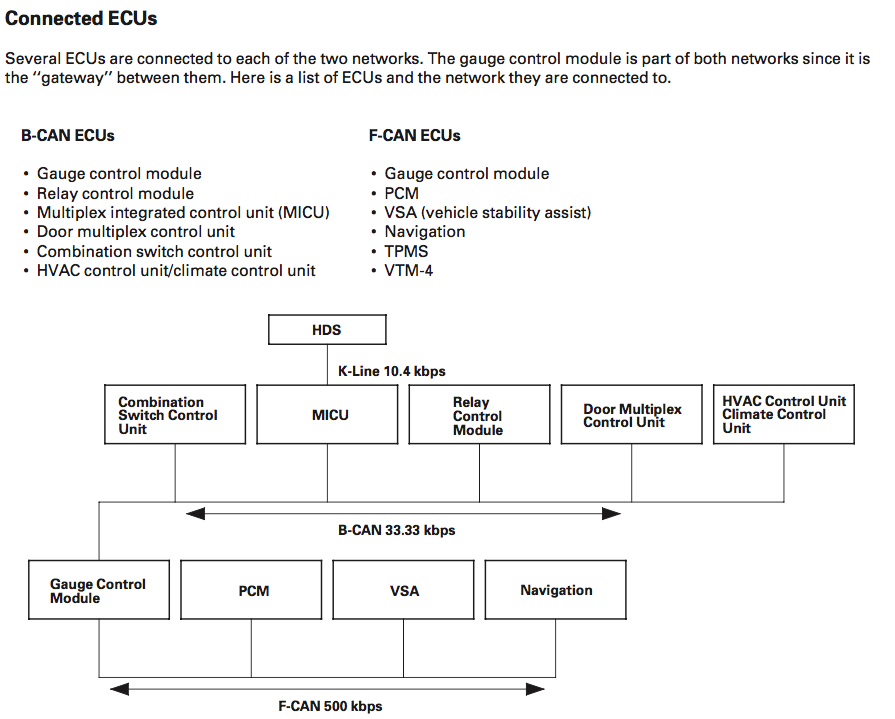
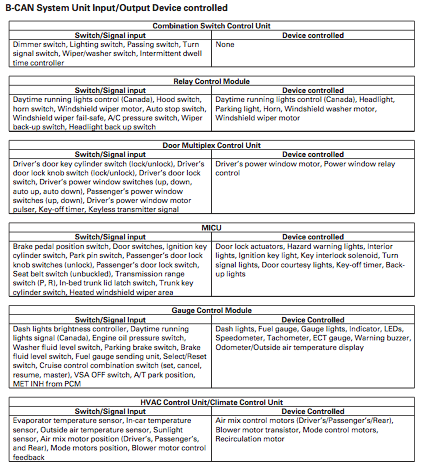

# HondaCan Protocol
Description of the Honda Can Protocol, at least in the 2006 Honda Ridgeline I tested this with

The CAN ECUs are divided into two separate networks: B-Can and F-Can  

#### B-Can (Body Can)
Body Can controls features like lights, locks, and windshield wipers

This is another diagram of the B-Can system. Notice that TPMS and VTM-4 are not included. I'm assuming that's becuase TPMS and VTM-4 do not send any messages that are relevent to the B-Can and are not replayed by the Gauge Control Module.
This means by contrast that the PCM, VSA Controller, and the Navigation Unit? all send messages that are replayed by the Gauge Control Module, or all listen for data from the B-Can network. Some of that may be messages sent to the Relay Control module? Or wheel speed sensors and rpm data?

These features depend on B-Can:
- Gauge control module
- Exterior lights
- Turn signals
- Entry light control
- Interior lights
- Safety indicators
- Heated windshield wiper area
- Horns (security and panic)
- Chimes (key, seat belt, lights-on, and parking brake)
- Power windows
- Power window/moonroof timer
- Wiper/washer
- Security
- Keyless entry
- Power door locks
- Climate control/HVAC control
- Key interlock
- Dash light brightness

#### F-Can (Functional Can)
Controls powertrain related features like gauges and stability control
